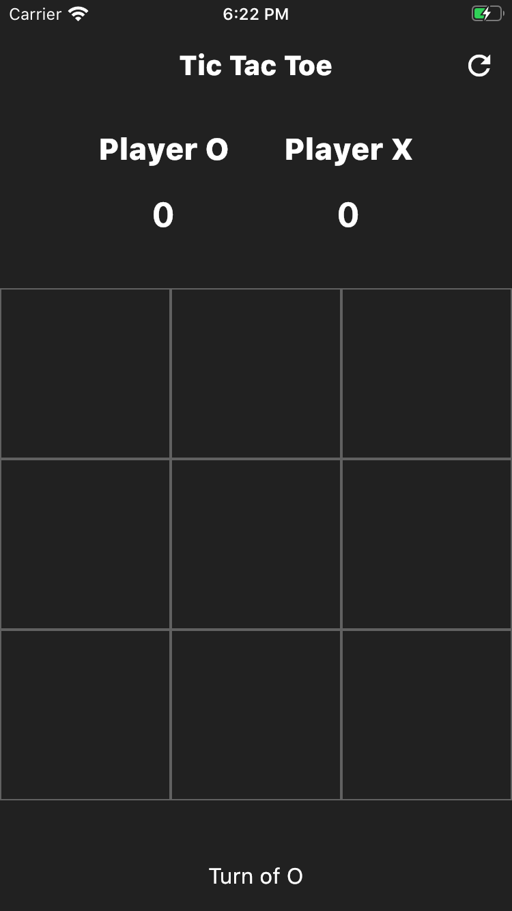

# Mobile Tic Tac Toe Game - Flutter Tutorial

In this project, we build a **Tic Tac Toe** game using Flutter. The tutorial covers step-by-step instructions to help you understand how to create this classic game for mobile devices.

## Features
- Classic **Tic Tac Toe** game for two players.
- Simple, intuitive UI built using Flutter widgets.
- Responsive design for mobile devices.
- Player turn indicators.
- Reset game functionality.

## Getting Started

### Prerequisites
To run this project, you need to have the following installed:  
- **Flutter SDK**: [Flutter installation guide](https://flutter.dev/docs/get-started/install)  
- **Dart SDK**: Comes with Flutter.  
- **Android Studio** or **Visual Studio Code** for development.  

### Running the App
1. Clone the repository:  
   `git clone https://github.com/Tyron-Barnard/Mobile-Tic-Tac-Toe.git`

2. Navigate to the project directory:  
   `cd Mobile-Tic-Tac-Toe`

3. Get the Flutter packages:  
   `flutter pub get`

4. Run the app on an emulator or connected device:  
   `flutter run`

### Project Structure
- `lib/`: Contains the Dart source files for the game.  
  - `main.dart`: Entry point of the app.  
  - `game.dart`: Contains the logic and state management for the Tic Tac Toe game.  
  - `board.dart`: UI for rendering the game board.  
- `assets/`: Contains images and assets used in the app.  
- `pubspec.yaml`: Configuration file for dependencies and assets.  

## Screenshots

## Future Improvements
- Add single-player mode with AI.  
- Implement score tracking across multiple rounds.  
- Add sound effects for moves and win/loss announcements.

## License
This project is licensed under the MIT License.
